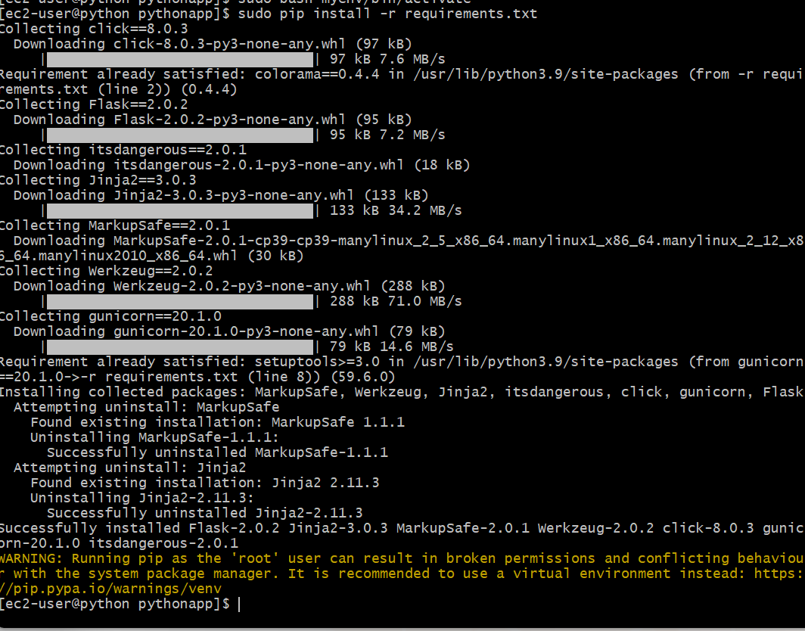
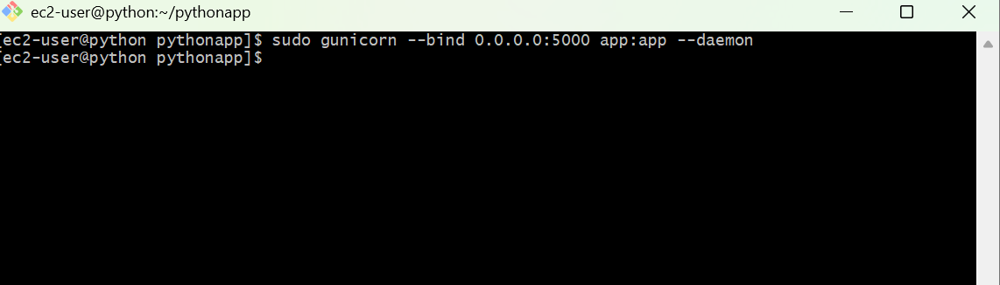
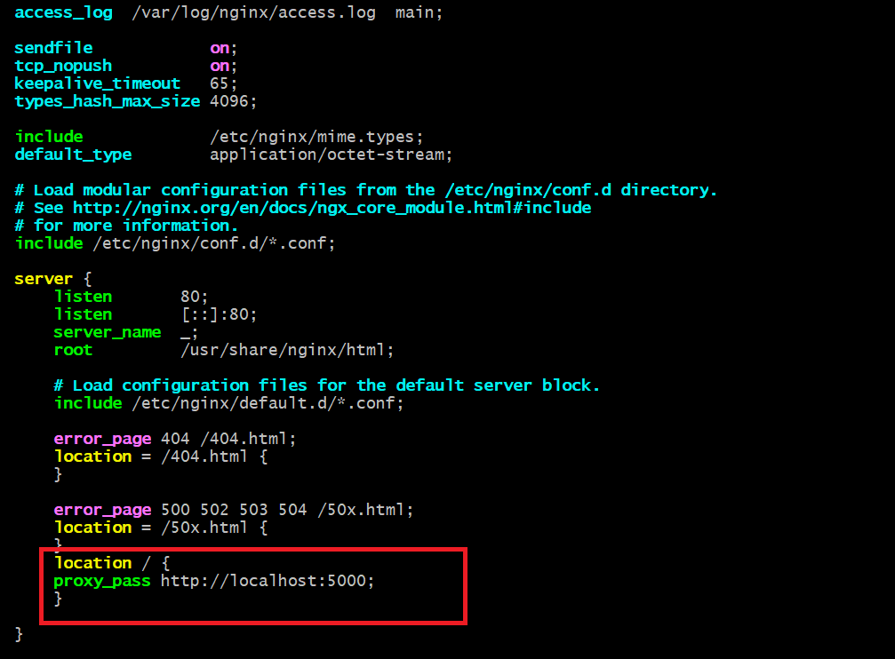
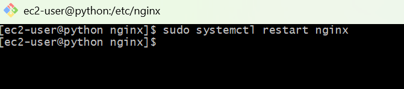
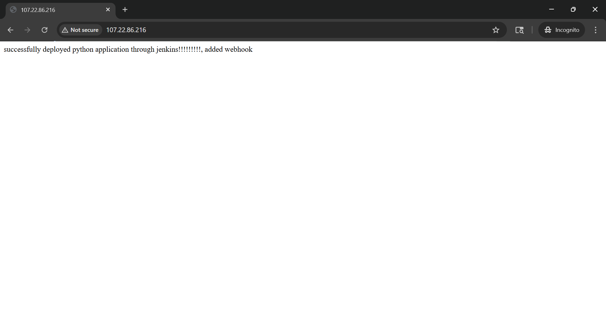

# Hosting a Python App on AWS EC2

A step-by-step guide to deploy a Python web application on an AWS EC2 instance using Gunicorn and Nginx.

---

## Prerequisites

- An AWS account with EC2 access
- A Python application with a `requirements.txt`
- SSH key pair (`.pem` file) for EC2 access
- Basic familiarity with the Linux command line

---

## 1. Launch an EC2 Instance

1. Log in to the [AWS Console](https://console.aws.amazon.com/) and navigate to **EC2 → Instances → Launch Instance**.
2. Choose an AMI: **nginx** (free tier eligible).
3. Select an instance type: `t2.micro` (free tier) or larger as needed.
4. Configure a **Security Group** with the following inbound rules:

   |Type  | Protocol | Port | Source    |
   |-------|----------|------|-----------|
   | SSH   | TCP      | 22   | Your IP   |
   | HTTP  | TCP      | 80   | 0.0.0.0/0 |
   | Costume | TCP    | 5000 | 0.0.0.0/0 |

5. Attach or create a **Key Pair** and download the `.pem` file.
6. Click **Launch Instance**.

---

## 2. Connect to Your Instance

```bash
# SSH into the instance (replace with your public IP or DNS)
ssh -i your-key.pem ubuntu@<EC2_PUBLIC_IP>
```

---

## 3. Server Setup & Prerequisites

Run the following on your EC2 instance:

```bash
# Update system packagesimage/install python.png
sudo yum update && sudo yum upgrade -y

# Install Python and pip
sudo yum install python3 -y
sudo yum install python3-pip -y

# Install Nginx
sudo apt install -y nginx

```


---

## 4. Deploy Your Application

```bash
# Clone your project (or use scp/sftp to upload files)
git clone https://github.com/your-username/your-repo.git
cd your-repo

# Create and activate a virtual environment
sudo python3 -m venv venv
bash venv/bin/activate

# Install dependencies
sudo pip install -r requirements.txt
```



Test that your app runs:

```bash
# Replace 'app:app' with your module:app_object
sudo gunicorn --bind 0.0.0.0:5000 app:app --daemon
```

---

## 5. Configure Nginx as a Reverse Proxy

```nginx
server {
    listen 80;
    server_name <EC2_PUBLIC_IP>;

    location / {
        proxy_pass http://localhost:5000;
    }
}
```

Enable the config and restart Nginx:

```bash
# Restart Nginx
sudo systemctl restart nginx
```

---

## 7. Verify Deployment

Open your browser and navigate to:

```
http://<EC2_PUBLIC_IP>
```


Your Python app should now be live. 

---

## Project Structure (Example)

```
your-repo/
├── app.py               # Main application entry point
├── requirements.txt     # Python dependencies
├── venv/                # Virtual environment (not committed to git)
└── ...
```
## Summary

This guide explains how to deploy a Python application in a production environment using Gunicorn and Nginx on an EC2 instance. It begins by setting up the server, installing necessary tools like Python, pip, and Git, and then cloning or uploading the application. A virtual environment is created to manage dependencies, which are installed from a requirements file. The application is then run in the background using Gunicorn. Nginx is configured as a reverse proxy to forward incoming requests to the application, improving performance, scalability, and security. Finally, the deployment is tested by accessing the application through the EC2 instance’s public IP address, ensuring a fully functional production setup.
